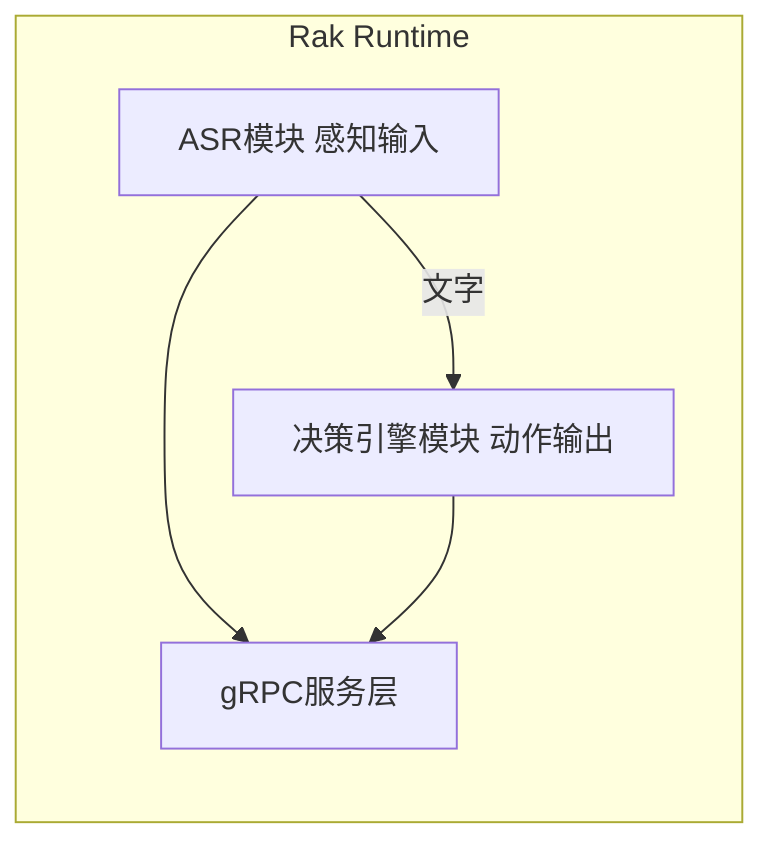

# rak rumtime（MVP）架构

## 一句话定位

rak rumtime 是“动作确认/参数转译器”：只输出单步动作，不做多步规划与长期记忆。

## 输入/输出（gRPC）

输入（ActionRequest）关键语义：

- `trace_id`：必须透传
- `available_actions`：Runtime 只能从这个集合里选动作
- `action`：可为空；不为空表示“动作确认”
- `params_json`：JSON 字符串；语义等价于 RakMessage.params

输出（ActionResponse）关键语义：

- `status=ok`：返回 `action + params_json`
- `status=error`：必须给出 `error_code + error_message`

## 决策模式

模式 1：动作确认

- 条件：输入 `action` 非空
- 规则：校验 action 是否在 `available_actions`，必要时补齐/修正 params_json

模式 2：状态转动作

- 条件：输入 `action` 为空
- 规则：基于 `state` 从 `available_actions` 中选择一个动作（必须稳定可复现）

## 不变式（必须保证）

- `trace_id` 原样返回
- 绝不返回 `available_actions` 之外的动作
- 任何失败都以 `status=error` 返回（不允许静默失败）

---

## 【新增】模块架构（v0.1）

Rak Runtime 现在包含两个完全解耦的核心模块：

### ASR模块特性
- 完全独立：不依赖决策引擎，可单独运行
- 本地部署：所有推理在本地完成，不联网
- 低延迟：端到端延迟<500ms
- 可替换：后续可无缝切换为FunASR等其他模型

### 模块间通信
- ASR模块通过内部函数调用向决策引擎提供文字输入
- 对外统一通过gRPC服务暴露接口
- 两个模块的错误完全隔离，一个模块崩溃不影响另一个